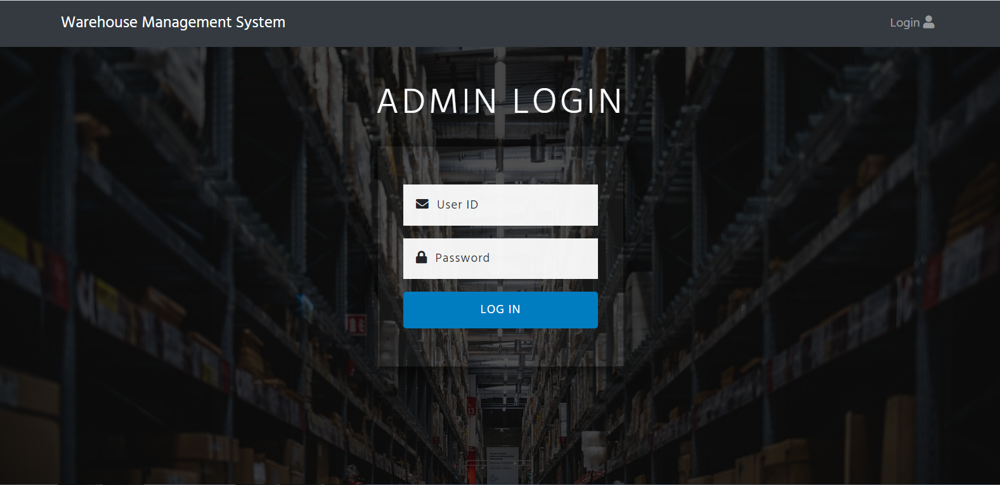
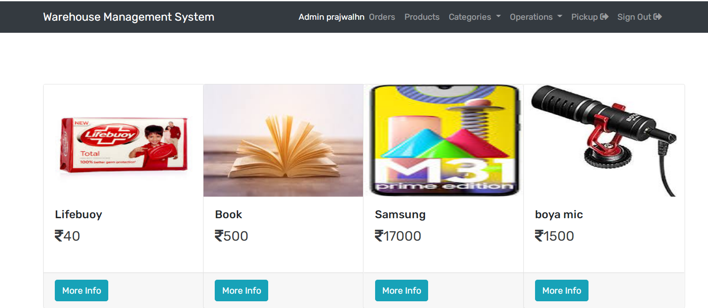

# Warehouse Management System

The warehouse management system(WMS) plays a very important role to reduce inventory costs. It not only reduces the cost but also helps to increase the ease of product delivery for a great customer experience.WMS definitely has a positive impact on the companies performance to compete at the global level. It shows the efficiency of a company to deliver the products ordered by a customer within a given time to the exact location. During this pandemic, we have noticed a high amount of traffic to e-commerce companies. What’s most important to any of these e-commerce companies is the warehouse with inventory. In order to manage these inventories within the warehouse, we need a good WMS. The main goal of WMS is to ensure the consistent availability of supplies for consumers.

# About the project

The project includes several operations that can be performed by the employee of a warehouse. The flow and operations of the project are described below:

● Home Page: This is the starting page of the module which gives all the product information which can be only viewed, but can be edited after login.                             

● Login Page: This is a page, which gives access to the control of operations within the warehouse. Only an employee with a user id and a password.

● Products Page: Employee can add a new product to the warehouse.

● Order Page: Employee can order a product if the product in the warehouse is out of stock or if new lot is required.

● Categories: It’s a button for filtering the content within the warehouse according to the product categories such as electronics, books etc.

● Pickup: It’s a page for setting up the pickup location for the product.

● Damaged Products: This is a page to enter all the damaged products in the warehouse if found any.

# Development Tools Used

Programming languages and tools used in making the project:

● HTML, CSS and Javascript.

● Node.js ( Node.js is an open-source, cross-platform, back-end, JavaScript runtime environment that executes JavaScript code outside a web browser).

● MySQL

● Visual Studio Code is used as the code editor for framing both front-end and back-end as it is programmer friendly and more efficient to handle.

● The tables are created using phpMyAdmin which is the most compatible software for MySQl.

● Xampp server is a simple, lightweight Apache distribution that makes it extremely easy for developers to create a local web server for testing and deployment purposes. It connects MySql and Javascript through Apache server.

● Web-Browser: Google Chrome/ Mozilla Firefox.

# Images

